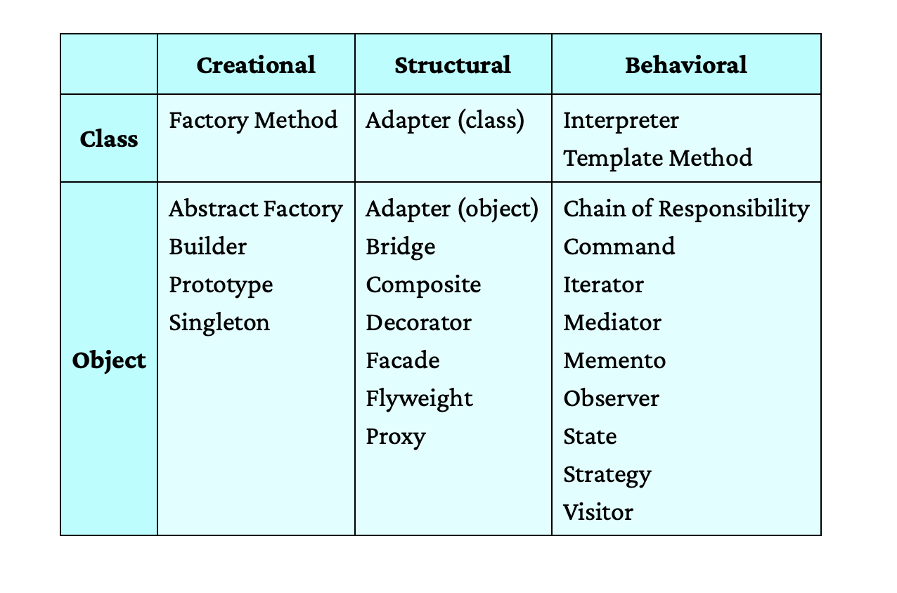

Class Based (Subclassing/ Overriding):
//TODO

---

FYI:
How the server works.

My Browser -> Sends http request to the endpoint -> Handshaking happens and post which the request is sent to that endpoint -> If loadbalancer is involved, the loadbalancer will again do this with the pod where it will be sending the request -> The pod when it starts runs an instance of the application and initiates its component along with the jetty server -> Now on receiving the request, Server has multiple worker thread to which it assigns the request -> Now each thread runs the code line by line starting from the resource layer.

Remember about the thread that the code is shared among the thread for a given process. So each thread goes line by line seperately.

So moral of the story:-
Code start hua-> Everything is compiled and class is loaded(static things that are associated with the class gets created in heap)-> Server up ho gaya(Code hi hai basically on keeping it listening) -> baki request wali line to tab chalegi jab requests ana start hoga and ye multiple threads me parallely chalti hain.

---