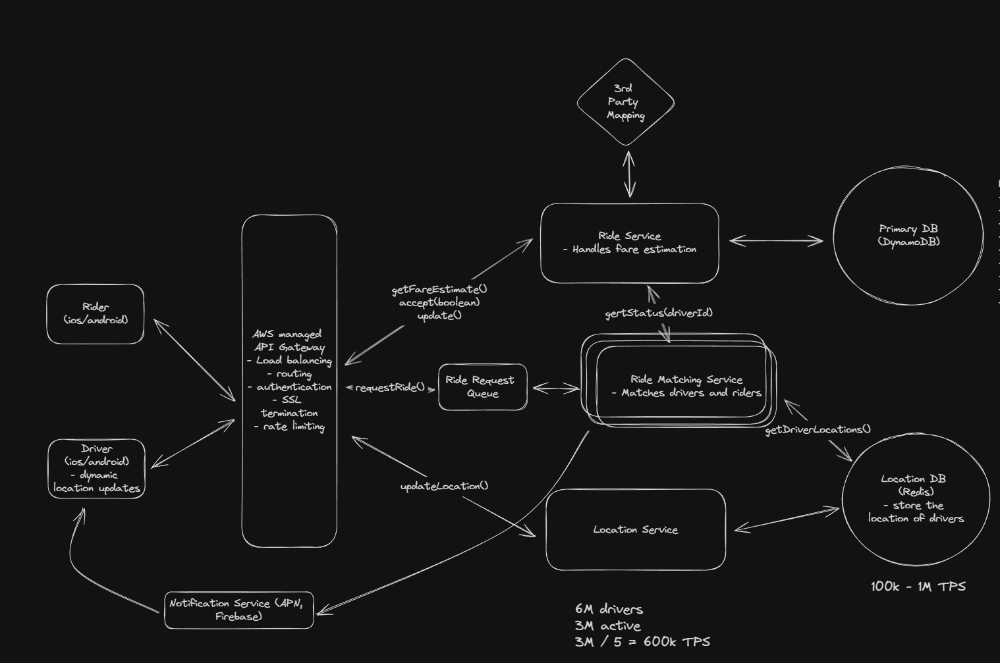

## Definition ##

Uber is a ride-sharing platforms that connect passengers with drivers who offer transportation services in personal vehicles. It all90ows users to book rides on-demand from their smartphones, mathcing them with a nearby driver who will take them from their loaction to their desired destination.

## Functional Requirements ##

1. User will enter the start location and the destination.
2. They will get the estimated amount and different types of cabs that are available.
3. Once a ride is selected, the system will search for the nearby unoccupied drivers.
4. The active drivers will be notified about this ride, they can then accept or reject the ride.
5. Once the driver accepts that ride, the driver will be shown the location of the user, and the user will be shown the realtime tracking of the driver's location.
6. Once the rider is there, the location will then be showing the drop location.
7. Once reached at the drop location, the payment will be done and the ride will be completed. (**Dont include this part in HLD**)

## Non Functional Requirements ## 
1. Consistency(Every node have same view of data) -> It is important to have a consistent status of the drivers and each of the rides, otherwise we might end up notifying a driver which is already occupied. ---NEEDED---
2. Availability(Can't let any node fail i.e. every valid requst will be 2xx. If we are okay with some failed responses to the user and increased latency, sacrifice it) -> In our use case, user can retry in case of some node failure and also it is okay to have the reduced latency. Hence should be fine. ---NOT NEEDED---
3. Partition Tolerance(One group of node A not able to communicate to another group of node B. Now this A can be different or same service instance. It can also happen that A is the DB nodes and B is the microservice nodes. ) -> This we always want. So don't talk about this, just evaluate between C and A about what they mean which one we are choosing.

4. 1:1 driver rider mapping

5. Handle high occassional surges for peak hours or special events. 
6. Should have low latency matching < 1 min to match or fail.

## Core Entities 

**We will read the functional requirement and drive the entities, no need to go the column level in HLD, just write down the entities.**

1. Rider -> Rider info
2. Location -> user(can be rider or driver's current location)
3. Driver -> Driver info and other metadata like active or not
4. Ride
5. Payment

## APIs

**Now read the functional requirements and design the APIs**

UserId, riderId are considered to be managed by the authtoken or cookie etc. No need to pass in the request.

1. GET /ride/rider/fare/estimate
QueryParams
startLocation, endLocation

2. POST /ride/rider/request
{
    startLocation:
    endLocation:
    cabType:
    price:
}

3. PATCH /ride/driver/
{
    rideId
    action: true/false 
}

4. POST /ride/rider/location/
{
    riderId:
    lat:
    long:
}

5. POST /ride/driver/location/
{
    driverId:
    lat:
    long:
}

6. POST /ride/status
{
    rideId:
    status: PENDING | ACCEPTED | PICKED | DROPPED | ...
}

## High-Level Design

About differet components:

1. We draw the participant and the API gateway first and mention the responsibility of the API gateway.
2. Now we pick API wise and decide microservices and the DB.
3. In deciding microservice, thing in terms of API, what are the different steps needed and which step will need to be scaled separately. create a separate microservice for that. otherwise a very crude way is to create a service for each of the entity.
4. Now while deciding the database -> Start with a single DB and table.
    Think in terms of 
    a. Transactional, if the two tables are interacting more frequently and the pattern needs to be trasnsactional.
    b. split when access patterns diverge (e.g., Rider/Driver are mostly reads/profile updates; Location is high-rate writes + geo-queries).
    c. isolate sensitive or long-retention data (payments, PII) into separate stores with stricter controls.

**How is the above one being utilised.**

API1-> get fare estimation

using the location, we will find the distance, traffic, ETA etc using the 3rd party service -> apply our own logic of the price calculation

1. Let's create a fare estimation service (we want to scale is as user traffic might come just to compare the price between different apps)
2.  It will interact with 3rd party service
3. Will access user info (Create a DB for that)

API 2 -> request a ride (Ride matching)

Create a ride -> Find a nearby active drivers -> notify them

0. Create a ride service and RideMatchingService separately
1. Ride matching service is handling the logic of getting driver info -> gettting there location -> notifying them. And it needs to scale separately, hence we create is separately.
2. Now ride service here has only one responsibility of creating a ride. Ideally don't let ridematching service direcly write to the ride service. Reasons:

a. If Matching writes the rides table directly, any schema change in Ride forces changes and coordinated deploys in Matching. That increases deployment risk.
b. Two match attempts might race to create the same ride. If RideService is the single writer it can reject duplicates using a request id. If Matching writes directly, you need extra lock or conflict resolution logic scattered across services

1. Create a ride table, (user and ride will be interacting mostly in a single transaction, create in the same db)
2. Create a driver table, (in the same DB, same reason)
3. Do we want to store the location of the driver in the same table -> NO (this will frequently update and will need some special table for geohashing etc) (We create a separate table and also in separate database as it will be some different kind of database and transactionality will nto come in picture as we dont' update anything in this table)

API 3 -> accept a ride

against a rideId rider will accept or reject it -> If accepted, the driver status will change the ride will be updated too -> User will be notified

1. Since we are making change in the ride and will continue doing so via the ride service.

## Deep Dives into the components