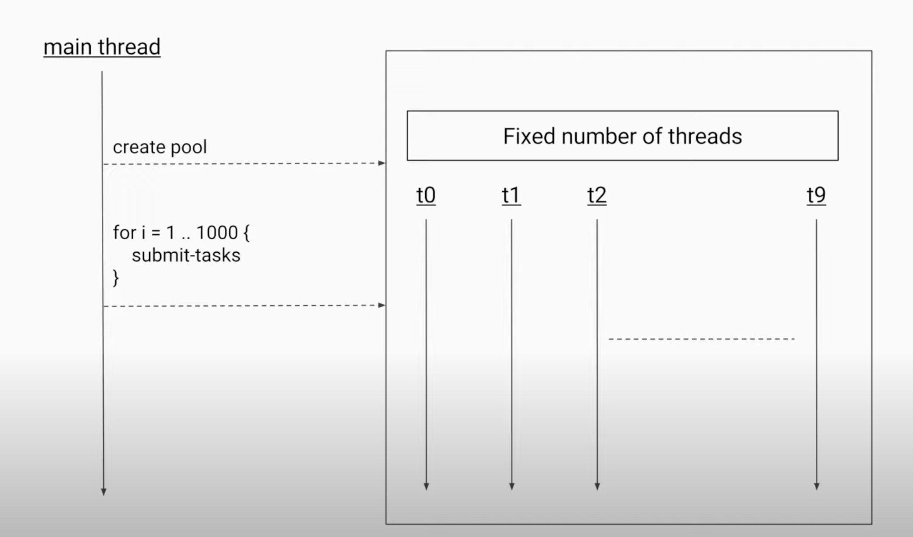

**Remember: Thread hum kitne bhi bana sakte, core pe depend karega parallely kitna chalega.**

# Executor Service #

The ```Thread thread1 = new Thread(runnable,name)``` allocates a platform thread. If we want 100 processes to go in parallel, each will create a new platform thread and this is bad because
1. is expensive to create thread as each thread requires systemcalls() and CPU time to create.
2. The number of cores of the cpu is limited, and creating more threads than the number of cores is anyway not going to increase its performance and will just block the memory for those idle threads.
3. Since there will be multiple threads in the active stage, the CPU will do the context switching frequently and performance will decrease.

The executor service is a higher level replacement for working with threads directly. It allows you to create a pool of threads and submit tasks to be executed by the thread pool. 

To choose an ideal pool size
1. If the tasks are CPU intensive, then the number of threads should be equal to the number of cores. This is because if more threads are created then cpu will be busy in context switching and this will add faltu ka overhead.
2. If the tasks are IO intensive, then the number of threads should be greater than the number of cores. This is because with the executor service our threads are limited, now let's say all of our reserved thread get busy with the IO operation, we won't be able to deploy new threads. If we have multiple threads, other thread of our program can go ahead.

***Refer to ExecutorServiceExmpl***

## Thread Pool Types ##

### Fixed Thread Pool ###
- Creates fixed number of thread
- Whenever a thread is free, a new task is deployed there from the blocking queue.
- Even if a thread dies due to an unchecked exception, the executor service will start a new one to maintain constant thread pool size.

### Cached Thread Pool ###
- Not fixed number of threads.
- It has a synchronous queue that has only space for a single task.
- It checks among its created thread whether they are free, If no one is free then it will create another thread.
- If thread is idle for 60 seconds, it is killed.
- I/O bound operations benefit from cached thread pools because:  
  Dynamic Scaling: The pool creates threads as needed when I/O tasks are submitted, allowing many concurrent I/O operations.  
  Waiting Doesn't Count as Idle: A thread waiting on I/O (e.g., network response) is still considered "busy" executing its task, not idle.  
  Resource Management: The 60-second timeout only applies after a thread completes its task and becomes available for reuse.

### Scheduled Thread Pool ###
- Has a fixed number of threads.
- Has a delay queue, here the tasks are arranged based on the time after which they are supposed to be scheduled.
- Different types are mentioned in ScheduledThreadPool.java

### Single Threaded Executor ###
- Similar to fixed Thread Pool but has only one thread.
- Ideal for sequential task (task1, then task2, then task3 etc.)

**About the different parameter in the ExecutorService https://www.youtube.com/watch?v=Dma_NmOrp1c**


