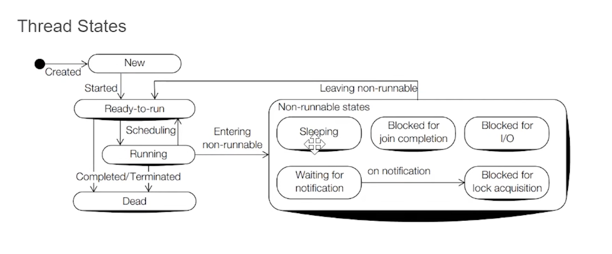

Thread State Journey

There are two states that a thread visits exactly once. It can never return to these states.

NEW: The moment new Thread() is created. It stays here until you call start().

TERMINATED: The moment the run() method completes (or crashes). The thread is dead. It can never be restarted.

The "Hub": RUNNABLE This is the central station. A thread cannot move from one waiting state directly to another (e.g., it cannot go from BLOCKED directly to WAITING). It must always pass through RUNNABLE

If the thread is executing instructions, it is in the RUNNABLE state.

Linear: NEW $\rightarrow$ RUNNABLE $\rightarrow$ TERMINATED.

Cyclic: RUNNABLE $\leftrightarrow$ BLOCKED / WAITING / TIMED_WAITING.

