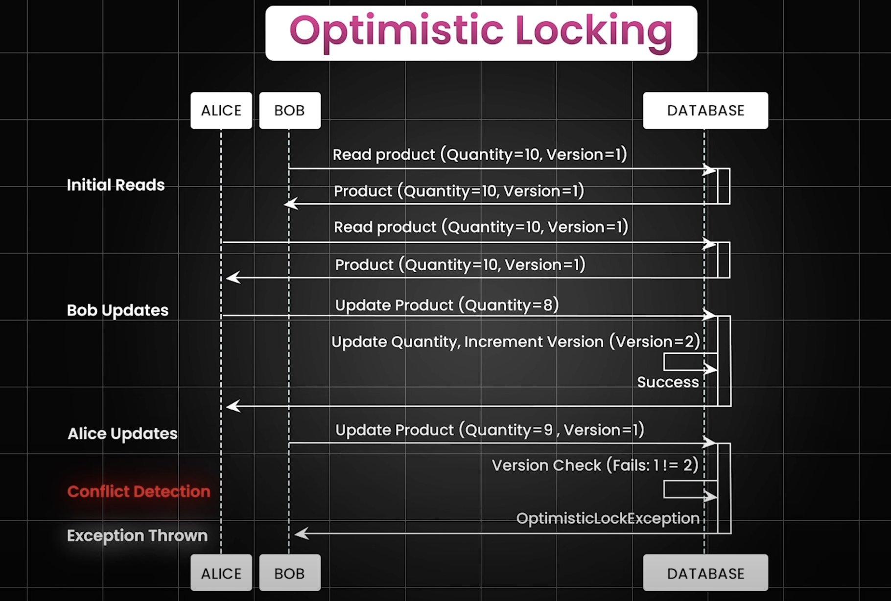

### Locking

When there is any critical section in our code, we do the locking to manage the data inconsistency.

## Pessimistic Locking

1) Pessimistic locking is a strategy where we lock the data before we start the operation on it.
2) We use this strategy when there are high chances of data inconsistency.
3) Its disadvantages are that it reduces the performance of the application and increases the response time.

## Optimistic Locking

By default, the optimistic locking is enabled in the JPA. We can disable it by using the `@Version` annotation.

1) Optimistic locking is a strategy where we lock the data only when we are about to commit the transaction.

Example image: 

2) We use this strategy when there are fewer chances of conflict.

3) Its disadvantages are that it increases the chances of data inconsistency if not handled properly.

4) Github is one of the example on how optimistic locking is implemented. When two users are trying to update the same file, the last user to commit the changes will get the conflict message.