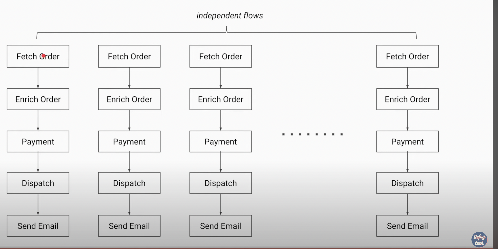

## Use Case ##

In above, we want each of the independent flow to be sync but complete flow of placing order to be sync.
If we do the above thing using the futures, we will do something like this:

or we can define a callable method for each flow and do all these dependent things in that so that they run synchronously. But if we want to further divide any subtaskto async, it will be complex.