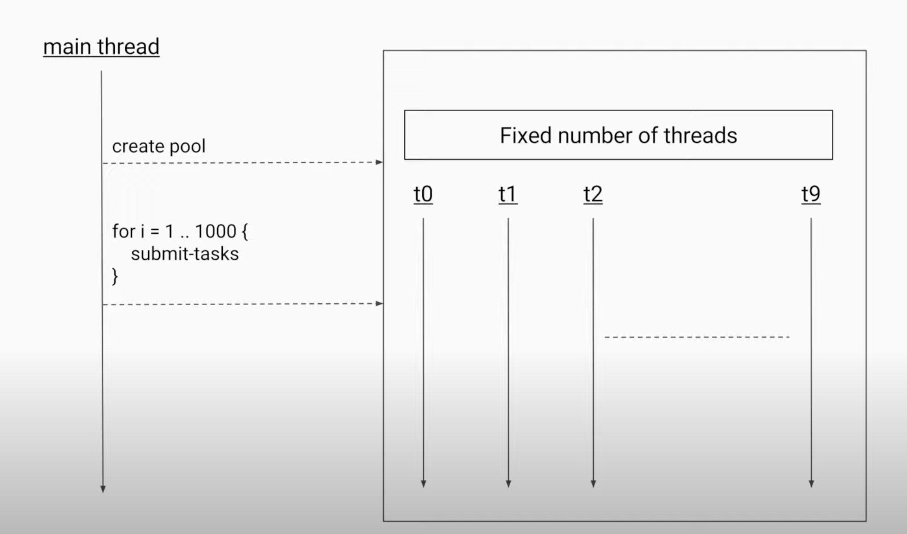

**Remember: Thread hum kitne bhi bana sakte, core pe depend karega parallely kitna chalega.**

## Executor Service ##

The ```Thread thread1 = new Thread(runnable,name)``` allocates a platform thread. If we want 100 processes to go in parallel, each will create a new platform thread and this is bad because
1. is expensive to create thread as each thread requires systemcalls() and CPU time to create.
2. The number of cores of the cpu is limited, and creating more threads than the number of cores is anyway not going to increase its performance and will just block the memory for those idle threads.
3. Since there will be multiple threads in the active stage, the CPU will do the context switching frequently and performance will decrease.

The executor service is a higher level replacement for working with threads directly. It allows you to create a pool of threads and submit tasks to be executed by the thread pool. 

To choose an ideal pool size
1. If the tasks are CPU intensive, then the number of threads should be equal to the number of cores. This is because if more threads are created then cpu will be busy in context switching and this will add faltu ka overhead.
2. If the tasks are IO intensive, then the number of threads should be greater than the number of cores. This is because with the executor service our threads are limited, now let's say all of our reserved thread get busy with the IO operation, we won't be able to deploy new threads. If we have multiple threads, other thread of our program can go ahead.

